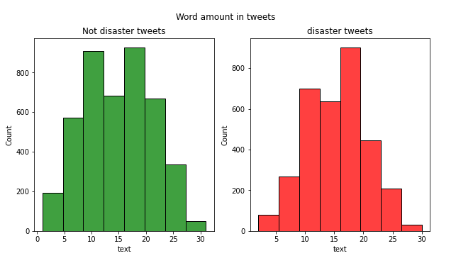
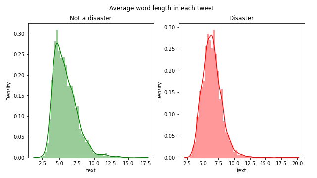
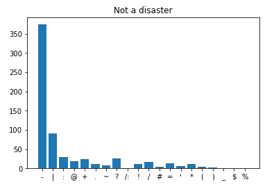
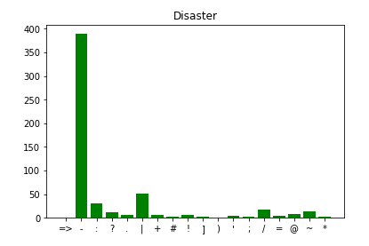
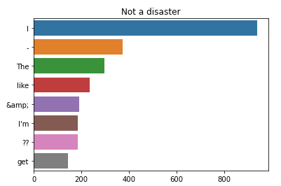
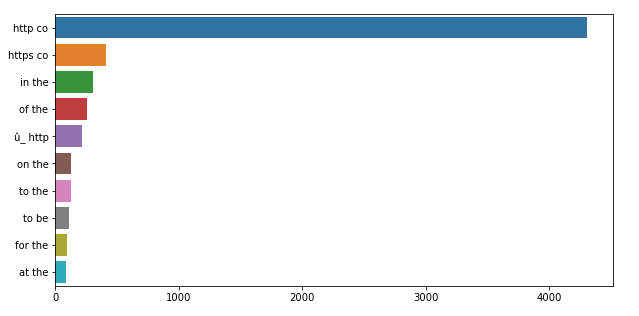
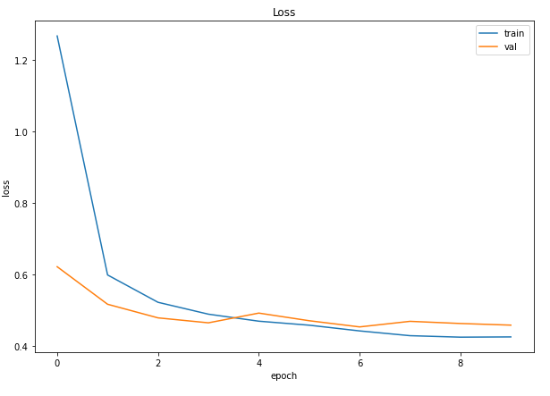
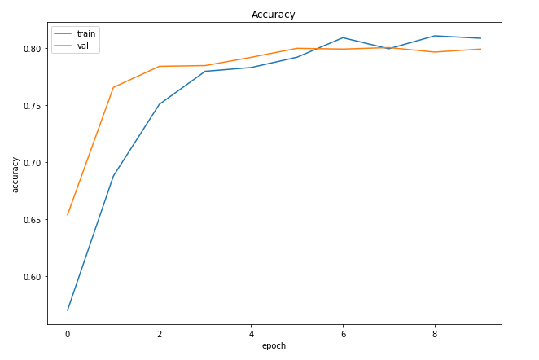

# Disaster Predictor using GPT2

* This repository is an attempt to use GPT2 to classify twitter sentiment using data from ["Natural Language Processing with Disaster Tweets"](https://www.kaggle.com/competitions/nlp-getting-started) Kaggle challenge.

## Overview

* The task, as defined by the Kaggle challenge, is to use the text file containing tweets from twitter user to classify if the tweet is talking about a diasster or not. The approach in this repository formulates the problem as a classificaiton task, using premade model GPT2 with the text file of tweets as the input. The model was able to classify with an accuracy of around 85%.

## Summary of Workdone

### Data

* Train:
  * Type: CSV
    * Input: Tweets from various users
	* Input: Target column with value 0 and 1 (0 if tweet is not about a disaster, 1 if yes)
  * Size: 973 KB
  * Instances: 10873 data points. 80% for training, 20% for validating.
* Test:
  * Type: CSV
    * Input: Tweets from various users
	* Output: A new column "target" with value 0 and 1 (0 if tweet is not about a disaster, 1 if yes)
  * Size: 415 KB
  * Instances: 10875 data points. All will be used for testing.

#### Data Visualization

  
  
Punctuation Count  
  
  
Common Word  
  
Common Word Combination  
  

#### Preprocessing / Clean up

* Punctuation removed (. , ; ? !)
* URL removed (https://....)
* HTML elements removed
* Emoticon, emojis element removed

### Problem Formulation

* Input: CSV file of text
* Output: A copy of CSV file with a new column "target" with values of 0 or 1 next to each data point.
* Text classification model
  * GPT2 premade model
  * AdamW optimizer
    * Epoch: 10
    * Batch Size: 32
	* Learning Rate: 1e-5
### Training

* Trained on Jupyter Notebook, on Intel Core i5-10600KF CPU.
* Took 3-4 hours.
* Stopped after training for 10 epoch.
  
  

### Future Work

* Get twitter users general opinion on a certain topic, restaurant, game, etc..., in a ratio of postive:negative comment
* Understanding what social media to certain personality type likes to hang out in and the distribution (Twitter: 35% ITNF, etc...)

## How to reproduce results

### Overview of files in repository

* [Datasets](): this folder contains the datasets to train and test data.
* [Output](): this folder will hold the new copy of the tested dataset with a new column 'target', see Performance Evaluation for details
* [Predict.py](): loads the trained model and pplies it to the test data
* [The Model.py](): trains the model in GPT2 and saves model during training.

### Software Setup
* Required libraries
  * os, joblib, numpy, pandas, matplotlib, string, re, nltk
  * tqdm (for visualizing loop progress)
  * sklearn, tensorflow, torch, transformers (for training and testing)
* If an import error occur, simply run:
  * !pip install (library name) to get the library
  * For anaconda, library can be found in their website with the code to run and install them
  
### Data

* If there are no csv file in the Datasets folder, data can be downloaded [here](https://www.kaggle.com/competitions/nlp-getting-started/data?select=train.csv)
* Simply scroll down and click download all
* Open the downloaded .zip file and extract the datasets into "Datasets" folder
  * If the folder does not exist, simply create a new folder and name it "Datasets"

### Training

* Simply run 'The Model.py'.
  * You can changes the epochs, learning rates, and batch sizes to however you prefer.
    * Changing the epochs value will affect how many cycle the training will take, but too little or too much epochs can affect the accuracy of the model.
	* Changing the learning rates the optimization of the model, higher learning rates may cause the model to not be optimized properly while lower learning rates will make convergence slower.
	* Changing the batch sizes will affect the learning time and memory requirement to train, the higher the batch sizes the longer it takes and the more memory is required.
* Once the code finished running, a new .pkl file will appear in the Training folder.

#### Performance Evaluation

* Drop the dataset you would like to test with in the [Datasets](https://github.com/DK-source/GPT2-DisasterPredictor/tree/main/Datasets) folder
* Simply run 'Predict.py' with an input of the 'CSV file name'.csv or leave blank for default path to test.csv
  * The output file will be in the [Output](https://github.com/DK-source/GPT2-DisasterPredictor/tree/main/Output) folder
  * This new copy will have a new column 'target' with a value of 0 or 1 next to each data point
    * 0 if tweet is not about a disaster
    * 1 if tweet is about a disaster

## Citations

* https://www.kaggle.com/competitions/nlp-getting-started/overview
* https://www.topbots.com/gpt2-text-classification-using-hugging-face-transformers/
* https://www.kaggle.com/code/baekseungyun/gpt-2-with-huggingface-pytorch

